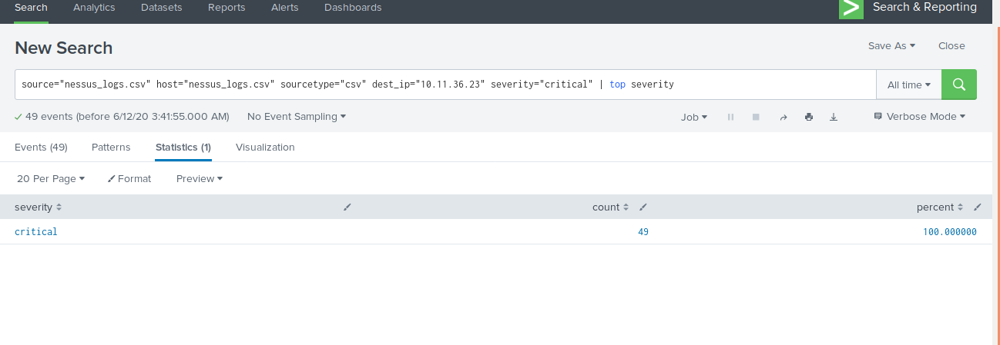

## Unit 18 Homework: Lets go Splunking!

### Scenario

You have just been hired as an SOC Analyst by Vandalay Industries, an importing and exporting company.

- Vandalay Industries uses Splunk for their security monitoring and have been experiencing a variety of security issues against their online systems over the past few months.

- You are tasked with installing new Splunk apps and developing searches, custom reports and alerts to monitor Vandalay's security environment in order to protect them from future attacks.

### System Requirements

You will be using the Splunk app located in the Ubuntu VM.

### Your Objective

Utilize your Splunk skills to design a powerful monitoring solution to protect Vandaly from security attacks.

After you complete the assignment you are asked to provide the following:

- Screen shots where indicated.
- Custom report results where indicated.

### Topics Covered in This Assignment

- Researching and adding new apps
- Installing new apps
- Uploading files
- Splunk searching
- Using fields
- Custom reports
- Custom alerts

Let's get started!

---

## Vandalay Industries Monitoring Activity Instructions

### Step 1: Monitoring Vandalay's Web Servers

**Background:**  As the worldwide leader of importing and exporting, Vandalay Industries has been the target of many adversaries attempting to disrupt their online business. Recently, Vandaly has been  experiencing DDOS attacks against their web servers.

**Task:** Install and configure a new Splunk App called **fping** to monitor Vandaly's web servers `198.153.194.1` and `198.153.194.2`.  As a reminder, fping is a utility that sends ICMP (ping) requests to an IP.

1. In the Splunk app on your Ubuntu VM, find and install the add-on called fping.
   - Note: You will likely have to restart Splunk when prompted.

2. After a successful install, select the new fping app from your list of available apps.

3. Configure the fping app to monitor the 2 web servers: `198.153.194.1` and `198.153.194.2`.

4. Let the monitoring run for about 10 minutes to collect some statistics. Provide a screenshot of the fping screen that displays the state of your web servers.

### Step 2: The Need for Speed

**Background**: Not only were web servers taken offline by a DDOS attack, but upload and download speed were also significantly impacted after the outage. Your networking team provided results of a network speed run around the time of the latest DDOS attack.

**Task:** Create a report to determine the impact that the DDOS attack had on download and upload speed. Additionally, create an additional field to calculate the ratio of the upload speed to the download speed.

1.  Upload the following file of the system speeds around the time of the attack.
    - [Speed Test File](resources/server_speedtest.csv)

2. Using the `eval` command, create a field called `ratio` that shows the ratio between the upload and download speeds.
   - Hint: The format for creating a ratio is: `| eval new_field_name = 'fieldA'  / 'fieldB'`

3. Create a report using the Splunk's `table` command to display the following fields in a statistics report:
    - `_time`
    - `ip_address`
    - `download_megabits`
    - `upload_megabits`
    - `ratio`

   Hint: Use the following format when for the `table` command: `| table fieldA  fieldB fieldC`

4. Answer the following questions:

    - Based on the report created, what is the approximate date and time of the attack?
    > Answer: 23-02-2020 14:30

    - How long did it take your systems to recover?
    > Answer: System recovered at 23-02-2020 23:30. It took almost 9 hours for system to recover.

Submit a screen shot of your report and the answer to the questions above.

### Step 3: Are We Vulnerable?

**Background:**  Due to the frequency of attacks, your manager needs to be sure that sensitive customer data on their servers is not vulnerable. Since Vandalay uses Nessus vulnerability scanners, you have pulled the last 24 hours of scans to see if there are any critical vulnerabilities.

  - For more information on Nessus, read the following link: https://www.tenable.com/products/nessus

**Task:** Create a report determining how many critical vulnerabilities exist on the customer data server. Then, build an alert to notify your team if a critical vulnerability reappears on this server.

1. Upload the following file from the Nessus vulnerability scan.
   - [Nessus Scan Results](resources/nessus_logs.csv)

2. Create a report that shows the `count` of critical vulnerabilities from the customer database server.
   - The database server IP is `10.11.36.23`.
   - The field that identifies the level of vulnerabilities is `severity`.
   > Answer:
   

3. Build an alert that monitors every day to see if this server has any critical vulnerabilities. If a vulnerability exists, have an alert emailed to `soc@vandalay.com`.
> Answer:

### Step 4: Drawing the (base)line

**Background:**  A Vandaly server is also experiencing brute force attacks into their administrator account. Management would like you to set up monitoring to notify the SOC team if a brute force attack occurs again.

**Task:** Analyze administrator logs that document a brute force attack. Then, create a baseline of the ordinary amount of administrator bad logins and determine a threshold to indicate if a brute force attack is occurring.

1. Upload the administrator login logs.
   - [Admin Logins](resources/Administrator_logs.csv)

2. When did the brute force attack occur?
   - Hints:
     - Look for the `name` field to find failed logins.
     - Note the attack lasted several hours.
> Answer: 21-02-2020 09:00 to 13:00

3. Determine a baseline of normal activity and a threshold that would alert if a brute force attack is occurring.
> Answer: Using the pattern tab we can determine around 78% or 784 events were Using Bad Username or passwords on 21-02-2020 alone.

4. Design an alert to check the threshold every hour and email the SOC team at SOC@vandalay.com if triggered.

---

© 2020 Trilogy Education Services, a 2U, Inc. brand. All Rights Reserved.
