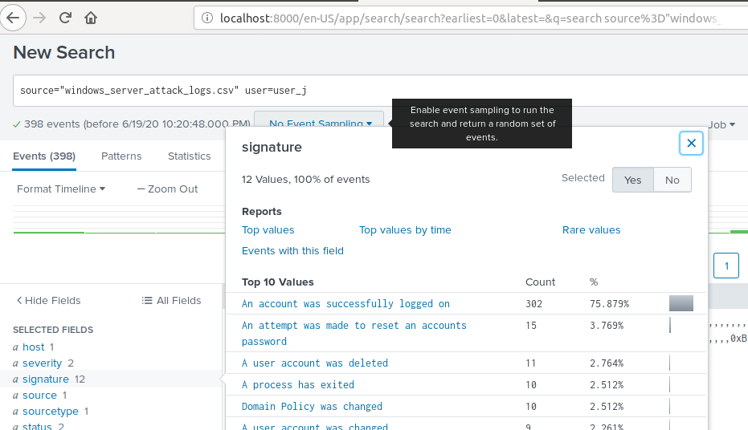

## Unit 19 Homework: Protecting VSI from Future Attacks

### Scenario

In the previous class,  you set up your SOC and monitored attacks from JobeCorp. Now, you will need to design mitigation strategies to protect VSI from future attacks.

You are tasked with using your findings from the Master of SOC activity to answer questions about mitigation strategies.

### System Requirements

You will be using the Splunk app located in the Ubuntu VM.

### Part 1: Windows Server Attack

Note: This is a public-facing windows server that VSI employees access.

#### Question 1
- Several users were impacted during the attack on March 25th.
- Based on the attack signatures, what mitigations would you recommend to protect each user account? Provide global mitigations that the whole company can use and individual mitigations that are specific to each user.
  >Answer: Based on the attack signatures; user_k, user_j and user_a accounts were impacted.

  >user_k:
  >attack signature: An attempt was made to reset an accounts password.

  

  >The recommended mitigation would be
  >at global level: whitelisting the ip of user_k
  >at user level: change the loginid &  password.

  >user_j:
  >signature: an account was successfully logged on

  

  >The recommended mitigation would be
  >at global level: Generate an alert for attempts made more than 5 times in span of 10 minutes
  >at user level: change the loginid & password.

  >user_a:
  >signature: An account was locked out

  

  >The recommended mitigation would be
  >at global level: Generate an alert for login retries more than 3 times.
  >at user level: change the loginid & password.

#### Question 2
- VSI has insider information that JobeCorp attempted to target users by sending "Bad Logins" to lock out every user.
- What sort of mitigation could you use to protect against this?
  >Answer: Change username and password of these accounts as the attacker knows username in all the cases possibly due to social engineering.

### Part 2: Apache Webserver Attack:

#### Question 1
- Based on the geographic map, recommend a firewall rule that the networking team should implement.
- Provide a "plain english" description of the rule.
  - For example: "Block all incoming HTTP traffic where the source IP comes from the city of Los Angeles."
     >Answer: "Block all incoming HTTP traffic where the source IP comes from the city of Kiev and Kharkiv in Ukraine."

- Provide a screen shot of the geographic map that justifies why you created this rule.

#### Question 2

- VSI has insider information that JobeCorp will launch the same webserver attack but use a different IP each time in order to avoid being stopped by the rule you just created.

- What other rules can you create to protect VSI from attacks against your webserver?
  - Conceive of two more rules in "plain english".
  - Hint: Look for other fields that indicate the attacker.
   >Answer: Rule 1. block all the events with byte size greater than 235
    
    Rule 2. Block all traffic using useragent Mozilla/4.0 (compatible; MSIE 6.0; Windows NT 5.2; SV1; .NET CLR 2.0.50727987787; Infopath.1)
    
