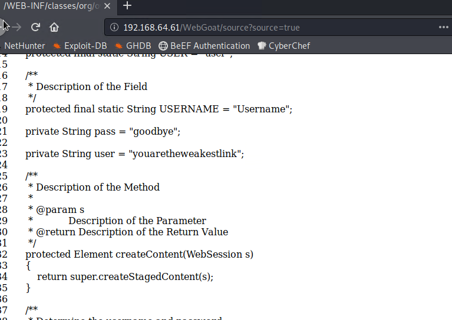
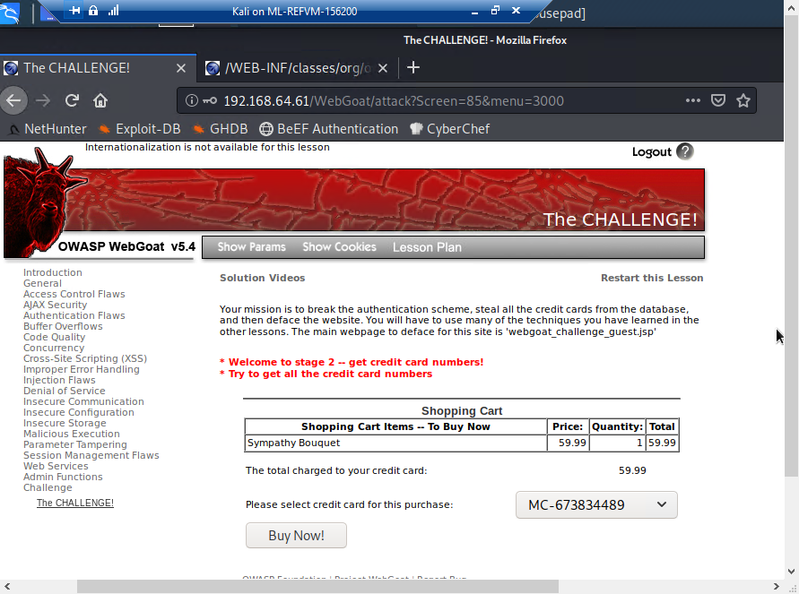
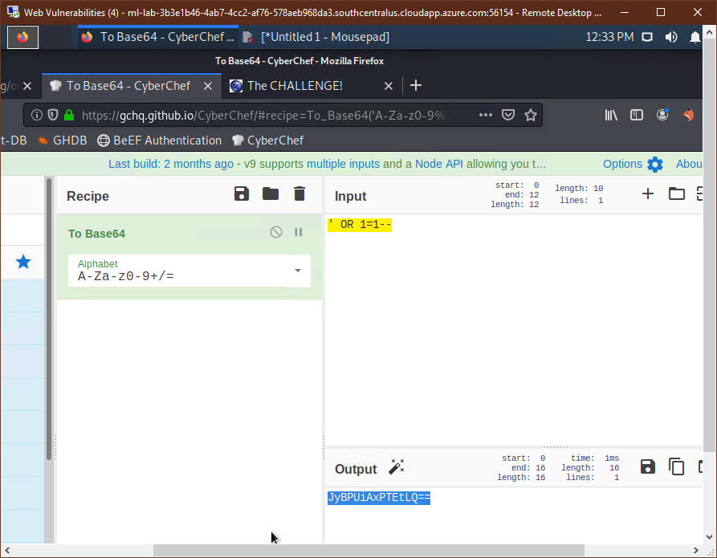
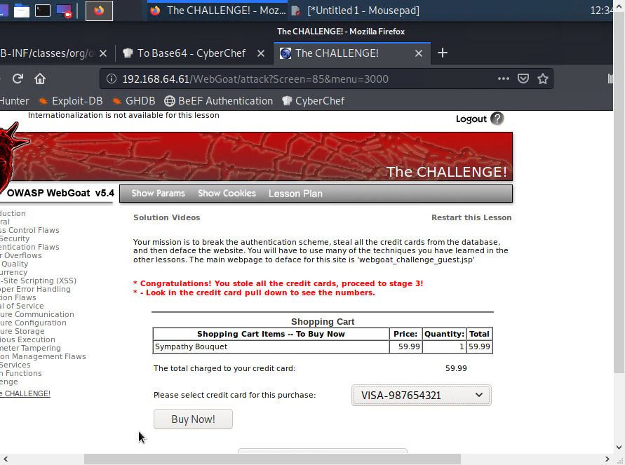
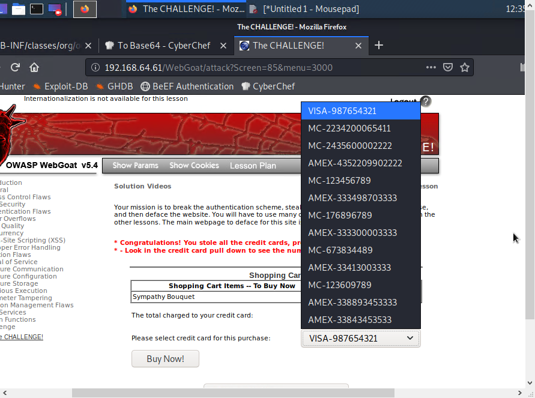

## Unit 15 Homework: Web Vulnerabilities and Hardening

### Part 1: Q&A

#### The URL Cruise Missile

The URL is the gateway to the web, providing the user with unrestricted access to all available online resources. In the wrong hands can be used as a weapon to launch attacks.

Use the graphic below to answer the following questions:

| Protocol         | Host Name                 | Path                   | Parameters               |
| ---------------- | :-----------------------: | ---------------------- | ------------------------ |
| **http://**      | **`www.buyitnow.tv`**     | **/add.asp**           | **?item=price#1999**     |


1. Which part of the URL can be manipulated by an attacker to exploit a vulnerable back-end database system?
##### Parameters part of URL can be manipulated by an attacker to exploit vulnerable back-end database system.

2. Which part of the URL can be manipulated by an attacker to cause a vulnerable web server to dump the `/etc/passwd` file? Also, name the attack used to exploit this vulnerability.
##### Path part of the URL can be manipulated by an attacker to cause vulnerable server to dump the `etc/passwd`. The attacker can use `Path Traversal` method to exploit this vulnerability.


3. Name three threat agents that pose a risk for injection attacks.
#####

4. What kinds of sources can act as an attack vector for injection attacks?
#####

5. Injection attacks exploit which part of the CIA triad?
##### Confidentiality, Integrity and Authenticity

6. Which two mitigation methods can be used to thwart injection attacks?
##### Input sanitation and Input validation methods can be used to thwart injection Attacks
____

#### Web Server Infrastructure

Web application infrastructure includes  sub-components and external applications that provide  efficiency, scalability, reliability, robustness, and most critically, security.

- The same advancements made in web applications that provide users these conveniences are the same components that criminal hackers use to exploit them. Prudent security administrators need to be aware of how to harden such systems.


Use the graphic below to answer the following questions:

| Stage 1        | Stage 2             | Stage 3                 | Stage 4              | Stage 5          |
| :------------: | :-----------------: | :---------------------: | :------------------: | :--------------: |
| **Client**     | **Firewall**        | **Web Server**          | **Web Application**  | **Database**     |


1. What stage is the most inner part of the web architecture where data such as, customer names, addresses, account numbers, and credit card info, is stored?
##### Database

2. Which stage includes online forms, word processors, shopping carts, video and photo editing, spreadsheets, file scanning, file conversion, and email programs such as Gmail, Yahoo and AOL.
##### Web Application

3. What stage is the component that stores files (e.g. HTML documents, images, CSS stylesheets, and JavaScript files) that's connected to the Internet and provides support for physical data interactions between other devices connected to the web?
##### Web server
4. What stage is where the end user interacts with the World Wide Web through the use of a web browser?
##### Client

5. Which stage is designed to prevent unauthorized access to and from protected web server resources?
##### Firewall
----


#### Server Side Attacks

In today’s globally connected cyber community, network and OS level attacks are well defended through the proper deployment of technical security controls such as, firewalls, IDS, Data Loss Prevention, EndPoint and security. However, web servers are accessible from anywhere on the web, making them vulnerable to attack.

1. What is the process called that cleans and scrubs user input in order to prevent it from exploiting security holes by proactively modifying user input.
##### Input sanitation

2. Name the process that tests user and application-supplied input. The process is designed to prevent malformed data from entering a data information system by verifying user input meets a specific set of criteria (i.e. a string that does not contain standalone single quotation marks).
##### Input validation

3. **Secure SDLC** is the process of ensuring security is built into web applications throughout the entire software development life cycle. Name three reasons why organization might fail at producing secure web applications.
```
- Implementation costs are high.
- Lack of support from management.
- Lack of standardization.
```
4. How might an attacker exploit the `robots.txt` file on a web server?
##### Attacker will attempt to harvest the robots.txt file using the URL to retrieve private data, such as content management system information and root directory structure.

5. What steps can an organization take to obscure or obfuscate their contact information on domain registry web sites?
##### The organization can use a proxy information instead of their contact information on domain registry websites

6. True or False: As a network defender, `Client-Side` validation is preferred over `Server-Side` validation because it's easier to defend against attacks.
##### False
   - Explain why you chose the answer that you did.
##### Because javaScript input validation performed on the client can be bypassed by an attacker that disables JavaScript or uses a Web Proxy. Therefor, input validation needs to be performed on the client as well as the server.

____

#### Web Application Firewalls

WAFs are designed to defend against different types of HTTP attacks and various query types such as SQLi and XSS.

WAFs are typically present on web sites that use strict transport security mechanisms such as online banking or e-commerce websites.

1. Which layer of the OSI model do WAFs operate at?
##### Application layer

2. A WAF helps protect web applications by filtering and monitoring what?
##### tcp packets

3. True or False: A WAF based on the negative security model (Blacklisting) protects against known attacks, and a WAF based on the positive security model (Whitelisting) allows pre-approved traffic to pass.
##### True
____

#### Authentication and Access Controls

Security enhancements designed to require users to present two or more pieces of evidence or credentials when logging into an account is called multi-factor authentication.

- Legislation and regulations such as The Payment Card Industry (PCI) Data Security Standard requires the use of MFAs for all network access to a Card Data Environment (CDE).

- Security administrators should have a comprehensive understanding of the basic underlying principles of how MFA works.

1. Define all four factors of multifactor authentication and give examples of each:

   - Factor 1
##### Standard Login input: eg passwords, PIN

   - Factor 2
##### Physical keys: eg: smart card or hard token

   - Factor 3
##### Biometrics: eg:fingerprint or retina

   - Factor 4
##### Location: GPS detection and callback on home phone.

2. True or False: A password and pin is an example of 2-factor authentication.
##### False. Both are Factor 1 type.

3. True or False: A password and `google authenticator app` is an example of 2-factor authentication.
##### True Password in factor 1 and Google authenticator is type of Factor 2 hard token

4. What is a constrained user interface?
##### Constrained user interface restricts what users can see and do based on their privileges. This can result in grayed-out or missing menu items or other interface changes.
----
____

### Part 2: The Challenge

In this activity, you will assume the role of a pen tester hired by a bank to test the security of the bank’s authentication scheme, sensitive financial data, and website interface.


#### Lab Environment   

We'll use the **Web Vulns** lab environment. To access it:
  - Log in to the Azure Classroom Labs dashboard.
  - Find the card with the title **Web Vulns** or **Web Vulnerability and Hardening**.
  - Click the monitor icon in the bottom-right.
  - Select **Connect with RDP**.
  - Use Credentials (azadmin:p4ssw0rd*)

- The lab should already be started, so you should be able to connect immediately.

- Refer to the [lab setup instructions](https://cyberxsecurity.gitlab.io/documentation/using-classroom-labs/post/2019-01-09-first-access/) for details on setting up the RDP connection.

Once the lab environment is running, open the HyperV manager and make sure that the OWASPBWA and Kali box is running.

- Then, login to the Kali VM and navigate to the IP address of the OWASPBWA machine.

- Click the option for 'WebGoat' and start the WebGoat app.

- Use the credentials: `guest`:`guest`

On the bottom of the left side of the screen, click on `Challenge` and then choose `The Challenge`.

**Note:** A common issue with this lab is the Challange activity failing to start successfully. Hit the `Restart the Lesson` button in the top right if you get an error starting the activity.

### The Challenge Instructions

#### Challenge #1

Your first mission is to break the authentication scheme. There are a number of ways to accomplish this task.

- **Hint #1**: Sometimes, form fields are shy!

- **Hint #2**: Find the hidden JavaScript.

After completing the first challenge, you will be provided with an option to continue to the next challenge.

##### Navigated to source of the challenge file that revealed the credentials


##### After entering the credentials, message displayed `challenge 1 completed`




#### Challenge #2

Next, steal all of the credit card numbers from the database.

- **Hint #1**: Sometimes cookies wear different clothes to change their appearances.

- **Hint #2**: Break your way into the conversation and inject your own ideas.

After completing the second challenge, you will be provided with an option to continue to the next challenge.
##### Using tamper data view the user value of the cookie

##### Using Cyberchef, encode the username for performing SQL injection and enter it into Tamper data.

##### Challenge 2 successful!

##### All credit card numbers revealed!


#### Challenge #3

Your third and final mission is no easy feat. Your final act is to deface the website. This requires multiple skill sets, all of which you’ve learned and will need for this final act.
Two clues:

- **Hint 1**: You will need to use command injection.

- **Hint 2**: You will need to locate the `webgoat_challenge_guest.jsp` file and inject it with code in order to deface the website.

---

--- ## :tada: MIssion Accomplished :tada:
